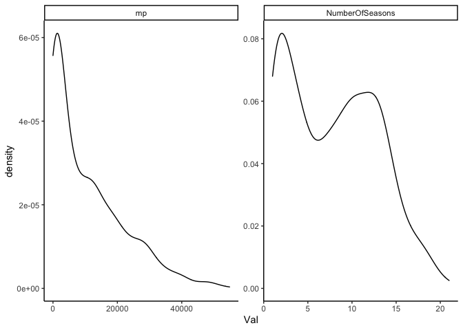
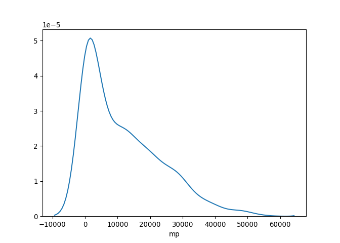
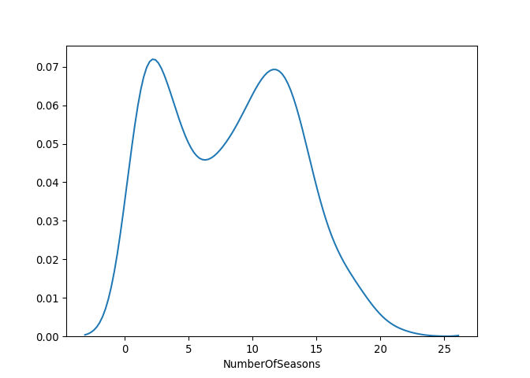

Untitled
================

## Analysis

This is the code for the post
[here](https://kieranshah.netlify.app/2020/08/06/prediciton-with-python/).

The basic process is as follows:

1.  read in the data, and select the variables
2.  divide the data into training and testing
3.  create a baseline comparison
4.  use lasso and random forest algorithms to predict minutes played
5.  evaluate the models

<!-- end list -->

``` python

import pandas as pd
import numpy as np

AnalyticalDS = pd.read_csv('AnalysisDS.csv')
```

<!-- -->

``` python

Dimension = AnalyticalDS.shape

print(Dimension)
```

    ## (949, 50)

<!-- -->

<!-- -->

The next step is to finalize the dataset, the training dataset, and then
the testing dataset. We first need to select the variables of interest,
and then divide the data up.

``` python

AboveMP_zero = AnalyticalDS['mp'] > 0
NotCurrent = AnalyticalDS['LastSeason'] != "2019-20"
AnalyticalDS_2 = AnalyticalDS[AboveMP_zero]
AnalyticalDS_2_a = AnalyticalDS_2[NotCurrent]
```

    ## /Users/rebeccashapiro/Library/r-miniconda/envs/r-reticulate/bin/python:1: UserWarning: Boolean Series key will be reindexed to match DataFrame index.

``` python
AnalyticDS_3 = AnalyticalDS_2_a[['link' ,'mp', 'age', 'FirstSeasonMP', 'fg', 'fga', 'ftpercent', 'FirstSeasonMP', 'PickNumber', 'fga', 'x3p', 'x3pa', 'x3ppercent', 'x2p' , 
'x2pa', 'x2ppercent', 'fgpercent', 'ft', 'fta', 'efgpercent', 'orb', 'drb', 'trb', 'ast', 'stl', 'blk', 'tov', 'pts','wprev', 'w_lpercentprev',  'wcur', 'w_lpercentcur']]
```

    ## /Users/rebeccashapiro/Library/r-miniconda/envs/r-reticulate/bin/python:1: SettingWithCopyWarning: 
    ## A value is trying to be set on a copy of a slice from a DataFrame.
    ## Try using .loc[row_indexer,col_indexer] = value instead
    ## 
    ## See the caveats in the documentation: https://pandas.pydata.org/pandas-docs/stable/user_guide/indexing.html#returning-a-view-versus-a-copy

<!--html_preserve-->

<style>html {
  font-family: -apple-system, BlinkMacSystemFont, 'Segoe UI', Roboto, Oxygen, Ubuntu, Cantarell, 'Helvetica Neue', 'Fira Sans', 'Droid Sans', Arial, sans-serif;
}

#bnwhbawaqc .gt_table {
  display: table;
  border-collapse: collapse;
  margin-left: auto;
  margin-right: auto;
  color: #333333;
  font-size: 16px;
  background-color: #FFFFFF;
  width: auto;
  border-top-style: solid;
  border-top-width: 2px;
  border-top-color: #A8A8A8;
  border-right-style: none;
  border-right-width: 2px;
  border-right-color: #D3D3D3;
  border-bottom-style: solid;
  border-bottom-width: 2px;
  border-bottom-color: #A8A8A8;
  border-left-style: none;
  border-left-width: 2px;
  border-left-color: #D3D3D3;
}

#bnwhbawaqc .gt_heading {
  background-color: #FFFFFF;
  text-align: center;
  border-bottom-color: #FFFFFF;
  border-left-style: none;
  border-left-width: 1px;
  border-left-color: #D3D3D3;
  border-right-style: none;
  border-right-width: 1px;
  border-right-color: #D3D3D3;
}

#bnwhbawaqc .gt_title {
  color: #333333;
  font-size: 125%;
  font-weight: initial;
  padding-top: 4px;
  padding-bottom: 4px;
  border-bottom-color: #FFFFFF;
  border-bottom-width: 0;
}

#bnwhbawaqc .gt_subtitle {
  color: #333333;
  font-size: 85%;
  font-weight: initial;
  padding-top: 0;
  padding-bottom: 4px;
  border-top-color: #FFFFFF;
  border-top-width: 0;
}

#bnwhbawaqc .gt_bottom_border {
  border-bottom-style: solid;
  border-bottom-width: 2px;
  border-bottom-color: #D3D3D3;
}

#bnwhbawaqc .gt_col_headings {
  border-top-style: solid;
  border-top-width: 2px;
  border-top-color: #D3D3D3;
  border-bottom-style: solid;
  border-bottom-width: 2px;
  border-bottom-color: #D3D3D3;
  border-left-style: none;
  border-left-width: 1px;
  border-left-color: #D3D3D3;
  border-right-style: none;
  border-right-width: 1px;
  border-right-color: #D3D3D3;
}

#bnwhbawaqc .gt_col_heading {
  color: #333333;
  background-color: #FFFFFF;
  font-size: 100%;
  font-weight: normal;
  text-transform: inherit;
  border-left-style: none;
  border-left-width: 1px;
  border-left-color: #D3D3D3;
  border-right-style: none;
  border-right-width: 1px;
  border-right-color: #D3D3D3;
  vertical-align: bottom;
  padding-top: 5px;
  padding-bottom: 6px;
  padding-left: 5px;
  padding-right: 5px;
  overflow-x: hidden;
}

#bnwhbawaqc .gt_column_spanner_outer {
  color: #333333;
  background-color: #FFFFFF;
  font-size: 100%;
  font-weight: normal;
  text-transform: inherit;
  padding-top: 0;
  padding-bottom: 0;
  padding-left: 4px;
  padding-right: 4px;
}

#bnwhbawaqc .gt_column_spanner_outer:first-child {
  padding-left: 0;
}

#bnwhbawaqc .gt_column_spanner_outer:last-child {
  padding-right: 0;
}

#bnwhbawaqc .gt_column_spanner {
  border-bottom-style: solid;
  border-bottom-width: 2px;
  border-bottom-color: #D3D3D3;
  vertical-align: bottom;
  padding-top: 5px;
  padding-bottom: 6px;
  overflow-x: hidden;
  display: inline-block;
  width: 100%;
}

#bnwhbawaqc .gt_group_heading {
  padding: 8px;
  color: #333333;
  background-color: #FFFFFF;
  font-size: 100%;
  font-weight: initial;
  text-transform: inherit;
  border-top-style: solid;
  border-top-width: 2px;
  border-top-color: #D3D3D3;
  border-bottom-style: solid;
  border-bottom-width: 2px;
  border-bottom-color: #D3D3D3;
  border-left-style: none;
  border-left-width: 1px;
  border-left-color: #D3D3D3;
  border-right-style: none;
  border-right-width: 1px;
  border-right-color: #D3D3D3;
  vertical-align: middle;
}

#bnwhbawaqc .gt_empty_group_heading {
  padding: 0.5px;
  color: #333333;
  background-color: #FFFFFF;
  font-size: 100%;
  font-weight: initial;
  border-top-style: solid;
  border-top-width: 2px;
  border-top-color: #D3D3D3;
  border-bottom-style: solid;
  border-bottom-width: 2px;
  border-bottom-color: #D3D3D3;
  vertical-align: middle;
}

#bnwhbawaqc .gt_striped {
  background-color: rgba(128, 128, 128, 0.05);
}

#bnwhbawaqc .gt_from_md > :first-child {
  margin-top: 0;
}

#bnwhbawaqc .gt_from_md > :last-child {
  margin-bottom: 0;
}

#bnwhbawaqc .gt_row {
  padding-top: 8px;
  padding-bottom: 8px;
  padding-left: 5px;
  padding-right: 5px;
  margin: 10px;
  border-top-style: solid;
  border-top-width: 1px;
  border-top-color: #D3D3D3;
  border-left-style: none;
  border-left-width: 1px;
  border-left-color: #D3D3D3;
  border-right-style: none;
  border-right-width: 1px;
  border-right-color: #D3D3D3;
  vertical-align: middle;
  overflow-x: hidden;
}

#bnwhbawaqc .gt_stub {
  color: #333333;
  background-color: #FFFFFF;
  font-size: 100%;
  font-weight: initial;
  text-transform: inherit;
  border-right-style: solid;
  border-right-width: 2px;
  border-right-color: #D3D3D3;
  padding-left: 12px;
}

#bnwhbawaqc .gt_summary_row {
  color: #333333;
  background-color: #FFFFFF;
  text-transform: inherit;
  padding-top: 8px;
  padding-bottom: 8px;
  padding-left: 5px;
  padding-right: 5px;
}

#bnwhbawaqc .gt_first_summary_row {
  padding-top: 8px;
  padding-bottom: 8px;
  padding-left: 5px;
  padding-right: 5px;
  border-top-style: solid;
  border-top-width: 2px;
  border-top-color: #D3D3D3;
}

#bnwhbawaqc .gt_grand_summary_row {
  color: #333333;
  background-color: #FFFFFF;
  text-transform: inherit;
  padding-top: 8px;
  padding-bottom: 8px;
  padding-left: 5px;
  padding-right: 5px;
}

#bnwhbawaqc .gt_first_grand_summary_row {
  padding-top: 8px;
  padding-bottom: 8px;
  padding-left: 5px;
  padding-right: 5px;
  border-top-style: double;
  border-top-width: 6px;
  border-top-color: #D3D3D3;
}

#bnwhbawaqc .gt_table_body {
  border-top-style: solid;
  border-top-width: 2px;
  border-top-color: #D3D3D3;
  border-bottom-style: solid;
  border-bottom-width: 2px;
  border-bottom-color: #D3D3D3;
}

#bnwhbawaqc .gt_footnotes {
  color: #333333;
  background-color: #FFFFFF;
  border-bottom-style: none;
  border-bottom-width: 2px;
  border-bottom-color: #D3D3D3;
  border-left-style: none;
  border-left-width: 2px;
  border-left-color: #D3D3D3;
  border-right-style: none;
  border-right-width: 2px;
  border-right-color: #D3D3D3;
}

#bnwhbawaqc .gt_footnote {
  margin: 0px;
  font-size: 90%;
  padding: 4px;
}

#bnwhbawaqc .gt_sourcenotes {
  color: #333333;
  background-color: #FFFFFF;
  border-bottom-style: none;
  border-bottom-width: 2px;
  border-bottom-color: #D3D3D3;
  border-left-style: none;
  border-left-width: 2px;
  border-left-color: #D3D3D3;
  border-right-style: none;
  border-right-width: 2px;
  border-right-color: #D3D3D3;
}

#bnwhbawaqc .gt_sourcenote {
  font-size: 90%;
  padding: 4px;
}

#bnwhbawaqc .gt_left {
  text-align: left;
}

#bnwhbawaqc .gt_center {
  text-align: center;
}

#bnwhbawaqc .gt_right {
  text-align: right;
  font-variant-numeric: tabular-nums;
}

#bnwhbawaqc .gt_font_normal {
  font-weight: normal;
}

#bnwhbawaqc .gt_font_bold {
  font-weight: bold;
}

#bnwhbawaqc .gt_font_italic {
  font-style: italic;
}

#bnwhbawaqc .gt_super {
  font-size: 65%;
}

#bnwhbawaqc .gt_footnote_marks {
  font-style: italic;
  font-size: 65%;
}
</style>

<div id="bnwhbawaqc" style="overflow-x:auto;overflow-y:auto;width:auto;height:auto;">

<table class="gt_table">

<thead class="gt_col_headings">

<tr>

<th class="gt_col_heading gt_columns_bottom_border gt_left" rowspan="1" colspan="1">

Model Name

</th>

<th class="gt_col_heading gt_columns_bottom_border gt_right" rowspan="1" colspan="1">

Mean Absolute Error

</th>

</tr>

</thead>

<tbody class="gt_table_body">

<tr>

<td class="gt_row gt_left">

Random\_Forest

</td>

<td class="gt_row gt_right">

6953.654

</td>

</tr>

<tr>

<td class="gt_row gt_left">

Bootstrapped\_Lasso

</td>

<td class="gt_row gt_right">

6805.126

</td>

</tr>

<tr>

<td class="gt_row gt_left">

Lasso

</td>

<td class="gt_row gt_right">

6817.436

</td>

</tr>

<tr>

<td class="gt_row gt_left">

Baseline

</td>

<td class="gt_row gt_right">

9742.516

</td>

</tr>

</tbody>

</table>

</div>

<!--/html_preserve-->
